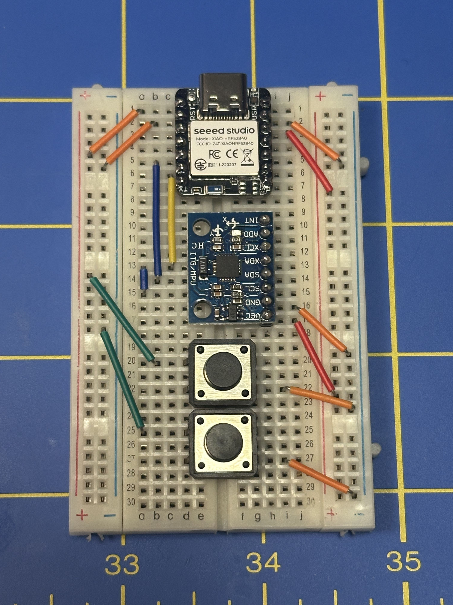

# AirMouse

## Overview

Use a [SeeedStudio nrf 52840](https://www.seeedstudio.com/Seeed-XIAO-BLE-nRF52840-p-5201.html) and [MPU6050](https://www.adafruit.com/product/3886) to control mouse input via gyro readings to create a pointing mouse.

Initial inspiration from https://www.youtube.com/watch?v=4CQLss0cH6k

## Pinout

See [pins.h](./include/am/pins.h)

- Button 1 -> Seeed `D0` (other leg to Seeed `GND`)
- Button 2 -> Seeed `D1` (other leg to Seeed `GND`)
- MPU `VCC` -> Seeed `3.3v`
- MPU `GND` -> Seeed `GND`
- MPU `SCL` -> Seeed `SCL` (`Pin 5`)
- MPU `SDA` -> Seeed `SDA` (`Pin 4`)

## Configuration

See [config.h](./include/am/config.h)

## Helpful Resources

- [Tech Talkies esp32 implementation](https://github.com/TechTalkies/YouTube/tree/main/48%20ESP32%20Air%20Mouse)
- [SeeedStudio Platformio setup](https://wiki.seeedstudio.com/xiao_nrf52840_with_platform_io/)
- [SeeedStudio nrf52840 pinout](https://www.seeedstudio.com/Seeed-XIAO-BLE-nRF52840-p-5201.html)

### Compiler Errors

- [No Serial](https://github.com/adafruit/Adafruit_nRF52_Arduino/issues/653#issuecomment-852702564)
- [EasyButton incompatibility](https://github.com/evert-arias/EasyButton/issues/50#issuecomment-1311926674)

## Next

- Reimplement with nrf52840 sense for integrated IMU
  - Similar Projects:
    - [Seeeduino XIAO Wireless Mouse Controller](https://github.com/melquidez/Seeeduino_XIAO_Wireless_Mouse_Controller)
    - [XIAO Controller](https://github.com/cifertech/XIAO-Controller)
- Smooth out mouse movements
- Implement tap/gesture detection

## Troubleshooting

When flashing the firmware you may need to set the board into bootloader mode.

Double click the tiny reset button to the left of the USB C port to enter bootloader mode.

Upload your script, and when it begins searching for the upload port, double click the reset button again.
